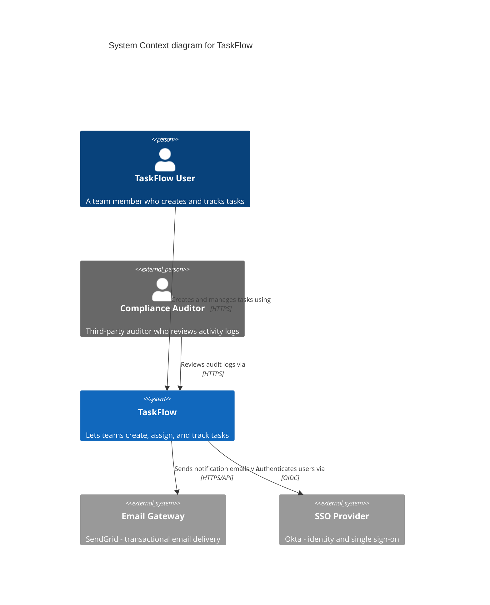
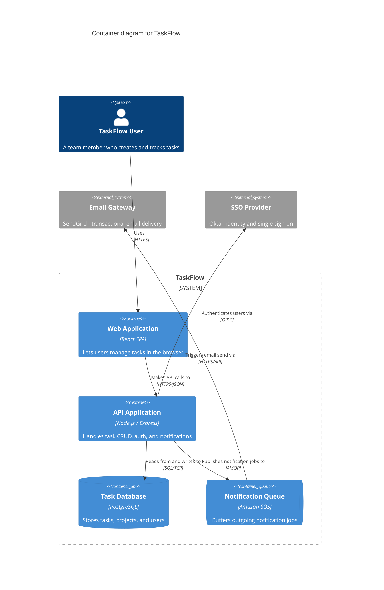
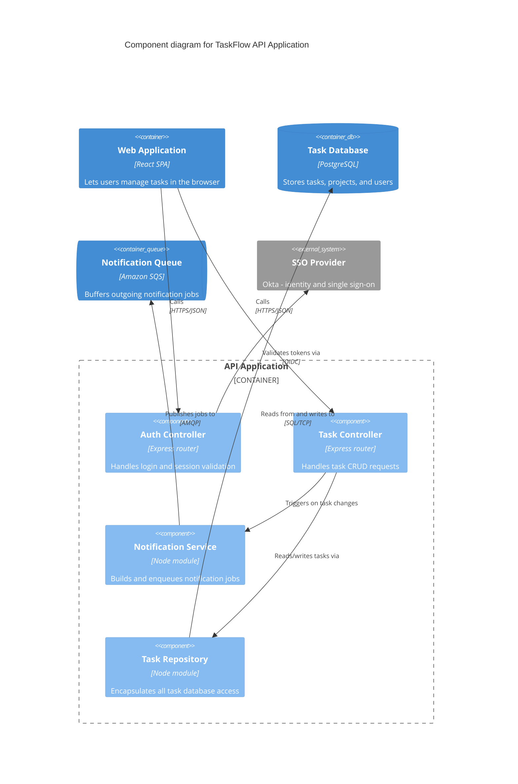

# Worked Examples

One example at each level, all describing the same fictional product —
**TaskFlow**, a small project-management web app — so you can see how the
same elements evolve as you zoom in. Every example follows every rule in
`c4-notation.md`; use them as a reference for syntax and for how much detail
is appropriate at each level, not as content to copy verbatim.

## System Context

> **Legend:** dark blue = your system/people, grey = external, lighter blue = deeper zoom level.

Notice: no internals of TaskFlow are shown, both external dependencies are
grey, and every relationship is a verb phrase with a protocol.

## Container

Zooming into TaskFlow itself:

> **Legend:** dark blue = your system/people, grey = external, lighter blue = deeper zoom level.

Notice: `System_Boundary` groups TaskFlow's own containers with a dashed box
and no fill, external systems stay grey and outside the boundary, and IDs
(`user`, `emailGateway`, `ssoProvider`) are reused unchanged from the Context
diagram.

## Component

Zooming into the API Application container:

> **Legend:** dark blue = your system/people, grey = external, lighter blue = deeper zoom level.

Notice: only the *one* container being zoomed into (`apiApp`) is broken into
components; its sibling containers (`webApp`, `db`, `queue`) appear as
un-expanded boxes for context, at their own Container-level color — this is
what keeps a Component diagram readable instead of dumping the whole
system's internals into one picture.
