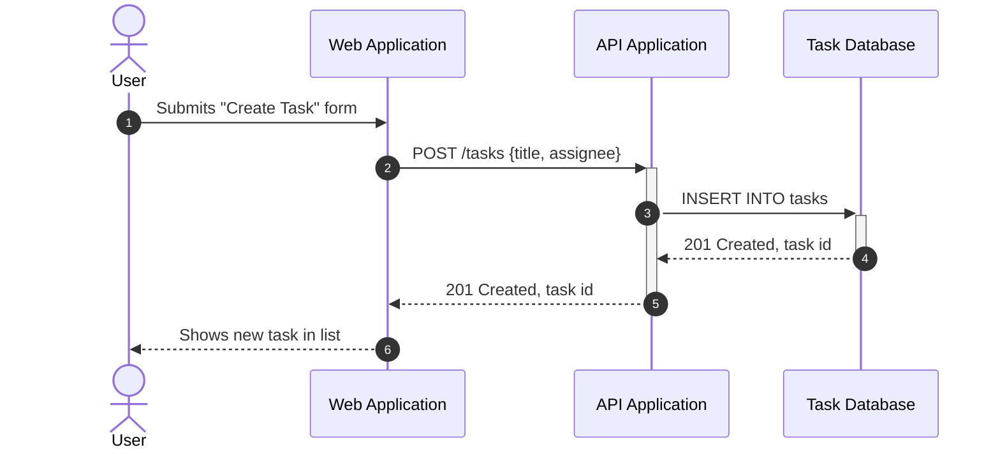

# Worked Examples

Two examples, both describing **TaskFlow** (the same fictional app used in
the `c4-diagram` skill's examples, so participant names line up with its
Container diagram) — a simple happy-path flow, and one that shows branching,
async messaging, and a failure path. Use these as syntax and judgment
references, not as content to copy verbatim.

## Simple flow: creating a task (happy path)



Notice: only two synchronous request/response pairs, each shown with
`->>`/`-->>` and activation bars (`+`/`-`) so it's visually clear the API and
database are "doing work" between the request and the reply. No branching is
needed because there's nothing to show going wrong in this simplified
version.

## Flow with branching, async messaging, and a failure path: submitting a task with notification

```mermaid
sequenceDiagram
    autonumber
    actor user as User
    participant webApp as Web Application
    participant apiApp as API Application
    participant ssoProvider as SSO Provider
    participant db as Task Database
    participant queue as Notification Queue
    participant emailGateway as Email Gateway

    user->>webApp: Submits "Create Task" form
    webApp->>+apiApp: POST /tasks {title, assignee}
    apiApp->>+ssoProvider: Validate session token

    alt token valid
        ssoProvider-->>-apiApp: 200 OK, user identity
        apiApp->>+db: INSERT INTO tasks
        db-->>-apiApp: 201 Created, task id
        apiApp-)queue: Publish TaskCreated event
        apiApp-->>-webApp: 201 Created, task id
        webApp-->>user: Shows new task in list
        queue-)emailGateway: Trigger "task assigned" email
    else token expired or invalid
        ssoProvider--xapiApp: 401 Unauthorized
        deactivate ssoProvider
        apiApp-->>-webApp: 401 Unauthorized
        webApp-->>user: Prompts re-login
    end
```

Notice: the `alt`/`else` block makes the failure path a first-class part of
the diagram instead of an afterthought, the queue publish and the email
trigger both use the open-arrowhead async syntax (`-)`) because neither
sender waits for the receiving side, the expired-token reply uses the
failed-response arrow (`--x`) with an explicit `deactivate` (the `-x` arrow
doesn't support the `+`/`-` shorthand cleanly, so state it separately), and
every activation opened with `+` is closed exactly once on every path
through the diagram — including the failure branch.
